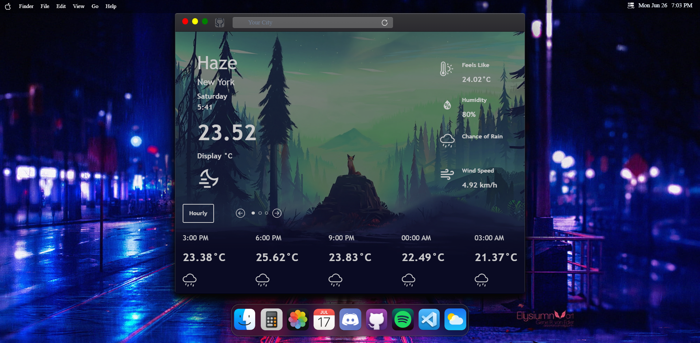

 
<h1 align="center">MacOS in React + TypeScript</h1>

A MacOS Clone built in TypeScript React with SASS and Framer Motion.

  Desktop showcase without any modals

 

## Short Description
This project is a macOS clone built using React and TypeScript. It aims to recreate the familiar and intuitive user interface of macOS within a web application. The combination of React's component-based architecture, TypeScript's type safety, and the sleek design of macOS provides a seamless and responsive user experience. Users will be able to interact with a macOS-like interface, including windows, menus, and toolbars, offering cross-platform compatibility and the convenience of a familiar operating system within their web browser.

## 🔴 Demo
🧪 [Live Demo](https://wolfgunblood.github.io/macos/) available. Click "Live Demo" to open it.

## Showcase
You can see images and a GIF of the project in user interaction below. 

 

## Features
- ✔️ Component-Based Architecture
- ✔️ Type Safety and Developer Experience
- ✔️ Responsive and Interactive UI
- ✔️ Integrated Weather App including geolocation to fetch forecasts for the user's location
- ✔️ Wallpaper Selection window to switch desktop backgrounds
- ✔️ Custom Context Menu and System Navigation Bar
- ✔️ Smooth Animations w/ [Framer Motion](https://github.com/framer/motion)

## Stack
- Framework: React
- Language: TypeScript
- Motion Library: Framer Motion
- Component Library: none
- Stylesheet: SCSS

## Motivation
The motivation behind building a macOS-like interface in React and TypeScript is to provide a familiar and intuitive user experience for web applications. macOS has been widely acclaimed for its sleek design, usability, and productivity-enhancing features. By recreating a similar interface using React and TypeScript, I aim to bring the power of macOS to the web.

## 🤝 Contributions
This project is open to contributions! I am still working on some features (Calculator, Calendar, VSCode, Music App) and there's probably a ton of things to add/change/fix. Feel free to fork it and create a PR!

All rights to all pictures, products and names on this website belong to Apple Inc. I only used them to build an environment for myself to learn coding in React with. This page is not being used commercially. If you are an owner of the copyrighted material, please let me know if you have any issues with this page and I'll take it down immediately